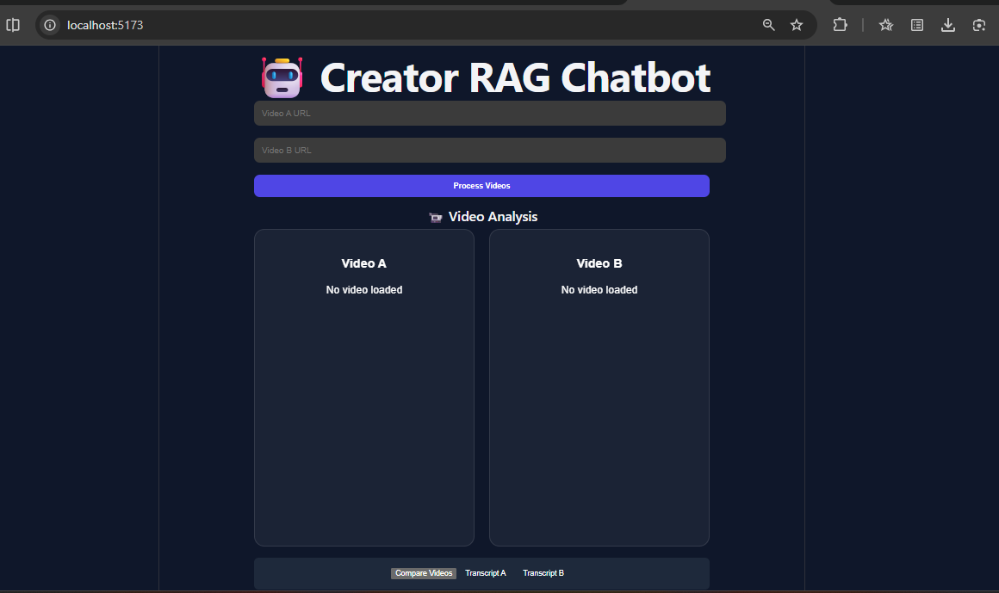
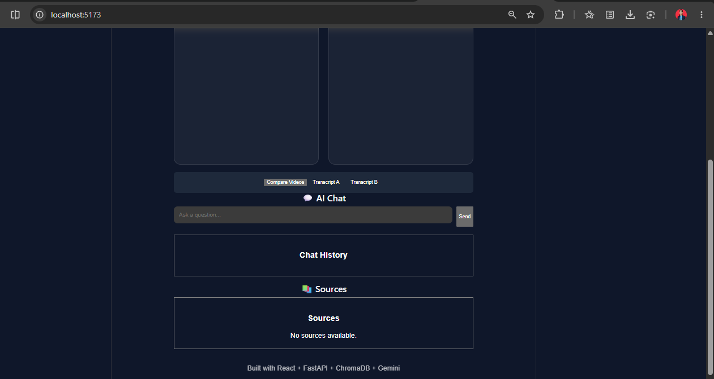
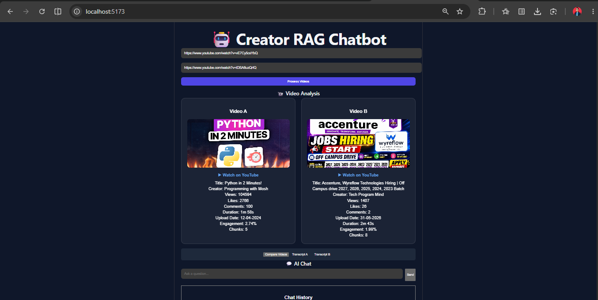
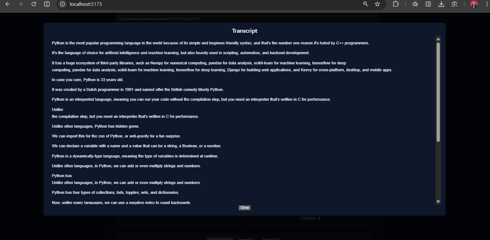
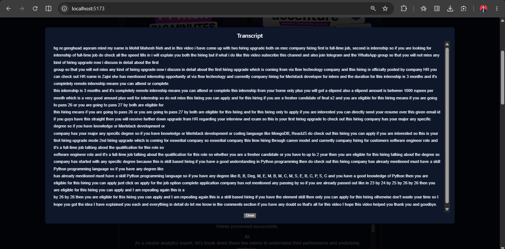
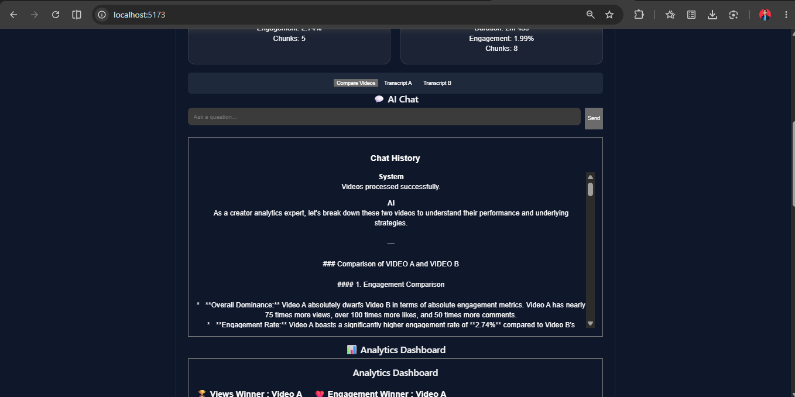
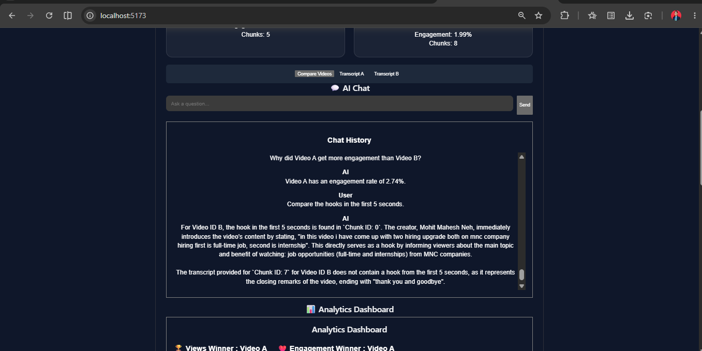
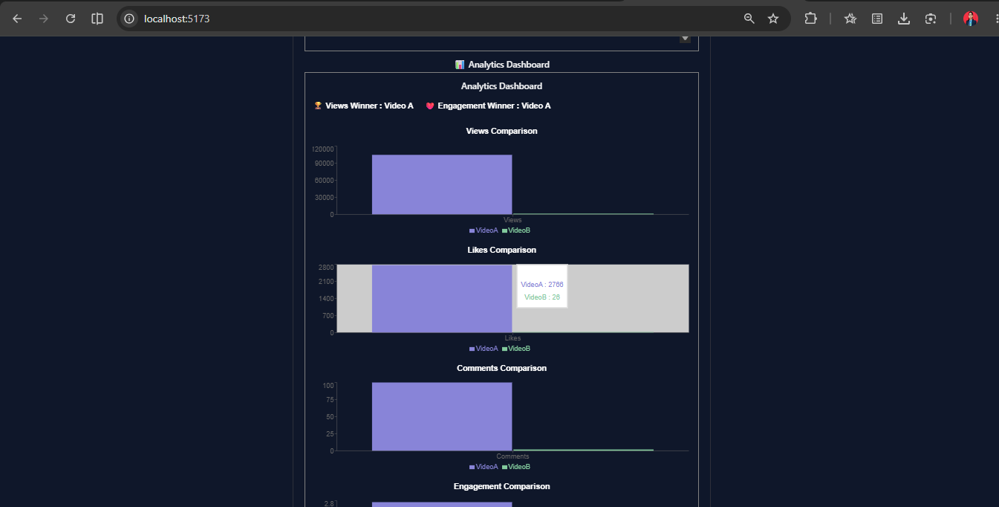
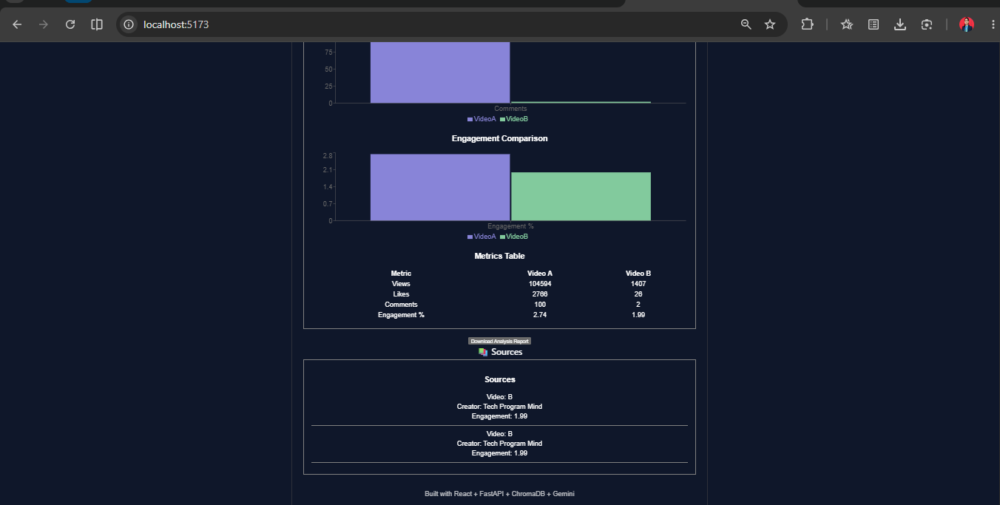

# 🚀 AI-Powered Creator Analytics & RAG Chatbot

An intelligent YouTube video analysis platform that combines **Generative AI**, **Retrieval-Augmented Generation (RAG)**, **Whisper AI**, and **YouTube Analytics** to compare creators, analyze engagement metrics, extract transcripts, and answer questions using contextual video content.

---

## 📌 Overview

The AI-Powered Creator Analytics & RAG Chatbot helps users analyze and compare YouTube videos by:

* Extracting video metadata
* Generating transcripts using Whisper AI
* Storing transcript chunks in ChromaDB
* Answering contextual questions using Gemini AI
* Comparing creator performance through interactive analytics dashboards
* Exporting comparison reports

This project demonstrates modern AI application development by integrating Large Language Models (LLMs), vector databases, speech-to-text processing, and full-stack web development.

---

## ✨ Features

### 🎥 YouTube Video Processing

* Accepts YouTube video URLs
* Extracts metadata automatically
* Supports comparison of two videos

### 📝 Transcript Extraction

* Downloads video audio using yt-dlp
* Generates transcripts using OpenAI Whisper
* Stores transcript chunks for semantic search

### 🧠 RAG-Based Question Answering

* Context-aware chatbot
* Uses transcript chunks as knowledge base
* Provides grounded responses based on video content

### 📊 Analytics Dashboard

* Views comparison
* Likes comparison
* Comments comparison
* Engagement rate comparison
* Winner identification

### 📄 Report Generation

* Download detailed comparison reports
* Includes creator insights and performance metrics

### 🔍 Transcript Viewer

* View full video transcripts
* Easy content exploration

---

## 🏗️ System Architecture

```text
YouTube URL
      │
      ▼
    yt-dlp
      │
      ▼
 Audio Extraction
      │
      ▼
  Whisper AI
      │
      ▼
 Transcript
      │
      ▼
 Text Chunking
      │
      ▼
 Embeddings
      │
      ▼
   ChromaDB
      │
      ▼
 Gemini AI
      │
      ▼
 Contextual Answers
```

---

## 🛠️ Tech Stack

### Frontend

* React.js
* Axios
* Recharts
* HTML5
* CSS3

### Backend

* FastAPI
* Python

### AI & Machine Learning

* Google Gemini AI
* OpenAI Whisper
* Retrieval-Augmented Generation (RAG)

### Database

* ChromaDB (Vector Database)

### Data Processing

* yt-dlp
* FFmpeg

---

## 📂 Project Structure

```text
creator-rag-chatbot/
│
├── backend/
│   ├── app.py
│   ├── ingest.py
│   ├── rag.py
│   ├── compare.py
│   ├── metadata.py
│   ├── whisper_transcript.py
│   ├── embedder.py
│   ├── chroma_db.py
│   └── requirements.txt
│
├── frontend/
│   ├── src/
│   │   ├── App.jsx
│   │   ├── main.jsx
│   │   └── components/
│   └── package.json
│
└── README.md
```

---

## ⚙️ Installation Guide

### 1️⃣ Clone Repository

```bash
git clone https://github.com/pritt18/creator-rag-chatbot.git
cd creator-rag-chatbot
```

---

### 2️⃣ Backend Setup

```bash
cd backend

pip install -r requirements.txt
```

Create a `.env` file:

```env
GEMINI_API_KEY=YOUR_API_KEY
```

Run Backend:

```bash
uvicorn app:app --reload
```

Backend URL:

```text
https://creator-rag-chatbot.onrender.com
```

---

### 3️⃣ Frontend Setup

```bash
cd frontend

npm install
npm run dev
```

Frontend URL:

```text
http://localhost:5173
```

---

## 📡 API Endpoints

### Home

```http
GET /
```

Returns API status.

---

### Process Videos

```http
POST /process-videos
```

Request:

```json
{
  "video_a_url": "youtube_url",
  "video_b_url": "youtube_url"
}
```

---

### Chat

```http
POST /chat
```

Request:

```json
{
  "question": "Who created Video A?"
}
```

---

### Compare Videos

```http
GET /compare
```

Returns analytics comparison.

---

### Transcript

```http
GET /transcript/{video_id}
```

Returns stored transcript.

---

## 📊 Metrics Calculated

### Engagement Rate

```text
Engagement Rate =
((Likes + Comments) / Views) × 100
```

Used to determine audience interaction effectiveness.

---

## 🚀 Future Enhancements

* Multi-video comparison
* Sentiment analysis
* Creator recommendation engine
* Trend prediction
* PDF report export
* Dashboard authentication
* Cloud deployment
* Video thumbnail insights
* Voice-based querying

---

## 💡 Key Learnings

* Retrieval-Augmented Generation (RAG)
* Vector Databases
* LLM Integration
* FastAPI Backend Development
* React Dashboard Development
* Whisper Speech Recognition
* YouTube Data Processing
* AI Application Architecture

---

## 📸 Screenshots

### Home Dashboard




### Video Comparison Dashboard



### Transcript Viewer





### AI Chat Interface





### Analytics Dashboard




---

## Live Demo

Frontend: https://creator-rag-chatbot-two.vercel.app

## 👨‍💻 Author

**Pritam Gangurde**

📧 pritamgangurde18@gmail.com

🔗 LinkedIn:
https://www.linkedin.com/in/pritam-gangurde-b51528249

💻 GitHub:
https://github.com/pritt18

---
